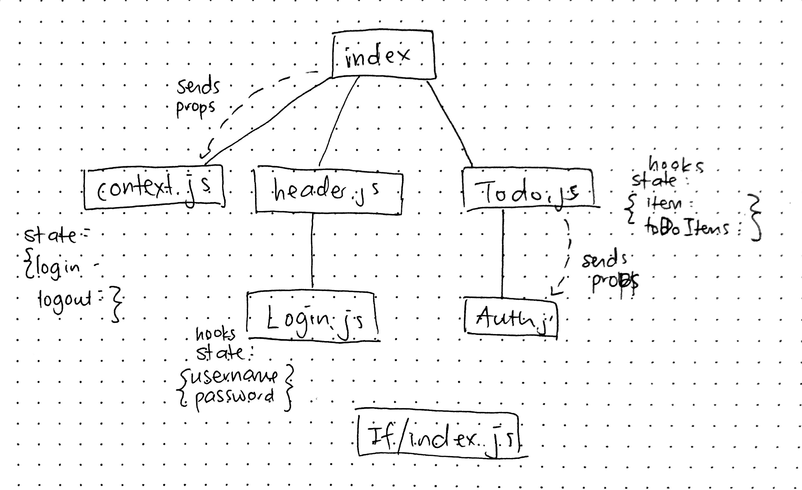

# LAB - 31

## React Hooks

### Author: Joanna Arroyo

### Links and Resources
* [submission PR](https://github.com/joanna-401-advanced-javascript/lab-31-hooks/pull/1)
* [travis](https://travis-ci.com/joanna-401-advanced-javascript/lab-31-hooks)

#### Documentation
* [styleguide](http://xyz.com)

### Modules
#### `index.js` `todo.js` `header.js` `auth.js` `context.js` `login.js` `if/index.js` 

##### Exported Values and Methods
###### `Todo -> React functional component`
###### `Header -> React component`
###### `Auth -> React functional component`
###### `Context -> React class component`
###### `Login -> React functional component`

### Setup
#### `.env` requirements
* `REACT_APP_API` - https://api-js401.herokuapp.com
* `REACT_APP_SECRET` - string for authentication token

#### Running the app
* `npm start`
  
#### Tests
* Unit tests: `npm run test`
* Lint tests: `npm run lint`

#### UML
